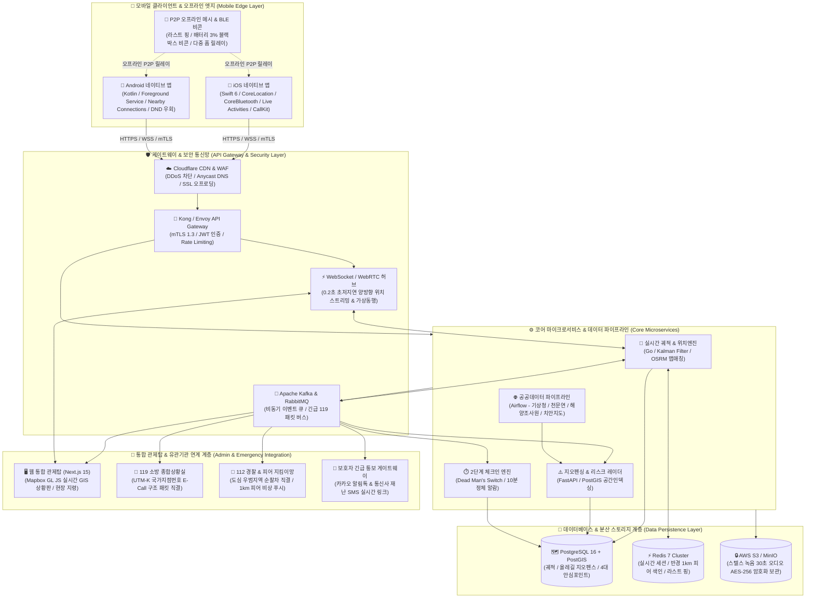

# 스마트 제주 트래블 가디언 (SMART JEJU TRAVEL GUARDIAN)
## 기술 개발 명세서 & 시스템 구현 아키텍처 (Technical Specification)

본 문서는 **스마트 제주 트래블 가디언** 플랫폼의 iOS 및 Android 모바일 네이티브 애플리케이션, 클라우드 백엔드, 웹 기반 통합 관제 시스템(Admin Dashboard)의 구축 방법, OS별 기술적/법적 제약 분석, 개발 난이도 및 소요 공수(MM)를 정의한 공식 엔지니어링 명세서입니다.

---

## 1. 시스템 전체 아키텍처 및 데이터 흐름 구조도 (System Architecture)

### 1.1 엔드투엔드 시스템 구조도 (Mermaid Flowchart)



### 1.2 계층별 아키텍처 상세 다이어그램

```
[ Layer 1: 클라이언트 계층 (Mobile & User Edge) ]
  ├── iOS 네이티브 앱 (Swift 6, CoreLocation, CoreBluetooth 메시, Live Activities, Critical Alerts)
  ├── Android 네이티브 앱 (Kotlin, Foreground Service, Nearby Connections, DND 우회, 센서 융합)
  └── IoT & P2P 오프라인 노드 (BLE 비콘 브리지, 비상 라스트 핑, 여행자 P2P 릴레이)
             │
             ▼ (HTTPS / WSS / mTLS 1.3)
[ Layer 2: 게이트웨이 & 실시간 통신망 (API Gateway & Security Layer) ]
  ├── Cloudflare CDN / DDoS 방어 / WAF
  ├── Kong / Envoy API Gateway (JWT 인증, Rate Limiting, 로드밸런싱)
  └── WebSocket & WebRTC 시그널링 허브 (0.2s 초저지연 양방향 위치 중계)
             │
             ▼ (gRPC / Async Event Bus - Kafka / RabbitMQ)
[ Layer 3: 코어 서비스 마이크로서비스 (Core Microservices & Event Stream) ]
  ├── 실시간 궤적 & 위치 추적 엔진 (Go, Kalman Filter, OSRM 맵 매칭)
  ├── 지오펜싱 & 리스크 레이더 (FastAPI, PostGIS 공간 인덱싱, 위험구역 판정)
  ├── 2단계 체크인 & 데드맨 스위치 (10분 정체자 이상 감지 알고리즘)
  └── 공공데이터 파이프라인 (Airflow / Celery - 기상청, 천문연, 해양조사원, 경찰청)
             │
             ▼ (JDBC / Redis Protocol / S3 API)
[ Layer 4: 데이터베이스 & 스토리지 계층 (Data Persistence Layer) ]
  ├── 공간 DB: PostgreSQL 16 + PostGIS (궤적, 안심포인트, 코스 지오메트리)
  ├── 인메모리 캐시: Redis 7 Cluster (실시간 핑, 세션, 반경 1km 피어 색인)
  └── 암호화 스토리지: AWS S3 / MinIO (스텔스 녹음 음성 파일 AES-256 저장)
             │
             ▼ (WebSocket / E-Call REST API / SMS Gateway)
[ Layer 5: 통합 관제탑 & 공공 연계망 (Admin & Emergency Integration) ]
  ├── 웹 통합 관제탑 (Next.js 15, React 19, Mapbox GL JS, 실시간 GIS 상황판)
  ├── 119 소방 종합상황실 & 112 경찰청 긴급 출동 지령 시스템 직결 (UTM-K 좌표)
  └── 보호자 긴급 SMS & 카카오 알림톡 게이트웨이
```

---

## 2. 모바일 플랫폼(iOS / Android) 및 관제 시스템 개발 명세

### 2.1 iOS 클라이언트 개발 명세
- **언어/프레임워크**: Swift 6, SwiftUI, Combine / Swift Concurrency
- **위치 관제**: `CoreLocation`
  - 평상시: `startMonitoringSignificantLocationChanges` (기지국/Wi-Fi 기반 배터리 소모 1% 미만)
  - 올레길/위험구역 진입 시: `kCLLocationAccuracyBestForNavigation` (초정밀 GPS 자동 승격)
- **오프라인 P2P 메시 릴레이**: `CoreBluetooth`
  - 기지국 통신 두절(`NWPathMonitor.currentPath.status != .satisfied`) 감지 시 `CBCentralManager` 및 `CBPeripheralManager` 듀얼 가동
  - **iOS 제약 회피:** 백그라운드 BLE 광고 지연 방어를 위해 `ActivityKit` 라이브 액티비티 킵얼라이브 세션 연동
  - 안드로이드 기기가 마스터 브리지(Relay Node)로 주로 동작하도록 비대칭 메시(Asymmetric Mesh) 토폴로지 채택
- **라스트 블랙박스 비콘 (배터리 3% 방전 직전)**:
  - `UIDevice.current.isBatteryMonitoringEnabled = true` 상시 감시
  - 배터리 3% 도달 시 OS 셧다운 직전 **'블랙박스 모드'** 진입:
    - 고전력 GPS 칩셋 및 백그라운드 태스크 전면 차단 (마지막 정상 좌표 Flash 메모리 동결)
    - `CBPeripheralManager.startAdvertising`으로 iBeacon/Eddystone 초저전력 펄스(TxPower 4dBm) 방출 (배터리 3% 전력으로 3~5시간 수색 드론용 비콘 유지)
- **무음 돌파 사이렌**: `AVAudioSession`
  - `.playback` 카테고리 + `.duckOthers` 설정 (Apple 공식 `Critical Alerts` Entitlement 승인 연동)
- **잠금화면 상태 중계**: `ActivityKit` (Live Activities & Dynamic Island)

### 2.2 Android 클라이언트 개발 명세
- **언어/프레임워크**: Kotlin 2.x, Jetpack Compose, Coroutines/Flow
- **백그라운드 지속 보장**: `Foreground Service` + `TYPE_LOCATION` & `TYPE_CONNECTED_DEVICE`
  - Doze 모드 화이트리스트(`REQUEST_IGNORE_BATTERY_OPTIMIZATIONS`) 획득
- **오프라인 P2P 메시 릴레이**: `Google Nearby Connections API` (Strategy: `P2P_CLUSTER`)
  - 기지국 없이 Wi-Fi Direct 및 BLE 듀얼 링크로 반경 100m 내 주변 여행자 단말과 애드혹(Ad-hoc) 메시 망 구성
  - 조난 패킷 발생 시 인접 단말로 다중 홉(Multi-hop) 자동 전파 ➔ LTE 가용 구역 진입 단말이 서버로 대리 업로드
- **라스트 블랙박스 비콘 (배터리 3% 방전 직전)**:
  - `ACTION_BATTERY_LOW` / `ACTION_BATTERY_CHANGED` 브로드캐스트 리시버 연동
  - 배터리 3% 감지 시 `BluetoothLeAdvertiser` 즉시 활성화:
    - `AdvertiseData.Builder().addManufacturerData()` 활용
    - 8바이트 압축 페이로드: `[위경도 6바이트 + 혈액형/기저질환 1바이트 + 배터리잔량 1바이트]`
    - 비연결형(Non-connectable) 1초 주기 브로드캐스팅 ➔ 119 수색 드론 및 구조대원이 페어링 없이 스캔만으로 조난자 식별
- **무음/방해금지 돌파 사이렌**:
  - `NotificationManager.isNotificationPolicyAccessGranted()`로 DND 해제 및 `AudioAttributes.USAGE_ALARM` 최대 볼륨 방출
- **스텔스 SOS 감지**:
  - `AccessibilityService` 전원/볼륨키 5회 연속 클릭 캡처

### 2.3 통합 관제 시스템 (Web Admin Dashboard) 개발 명세
- **프레임워크**: Next.js 15 (App Router), TypeScript, TailwindCSS, Zustand
- **실시간 GIS 지도 엔진**: `Mapbox GL JS` 또는 `Kakao Maps API v2`
  - WebGL 기반 대용량 렌더링 (동시 접속 수만 명의 핀 클러스터링 및 히트맵 처리)
- **실시간 데이터 스트리밍**: `WebSocket / Socket.io`
  - 조난, 10분 정체, 코스 이탈, 피어 SOS 발생 시 0.2초 이내 관제 화면 팝업 경보
- **119 상황실 연동 지령서 모듈**:
  - 국가지점번호 자동 변환 라이브러리(`UTM-K` 좌표계 변환)
  - 원클릭 119 E-Call 지령 패킷 발권 및 관할 소방본부/해경 API 자동 전송

---

## 3. OS별 기술적·법적 제약 및 불가능/제한 항목 심층 검토

### 3.1 숙소 불법촬영 점검 (IR 적외선 렌즈 & Wi-Fi IP 스캐닝) 현실성 및 구현 계획

#### [현실적 가능 여부 결론]
**조건부 구현 가능 (실효 검출율 약 75%~85%)**.  
단일 센서나 일반 카메라만으로는 물리적/보안적 한계가 명확하므로, **"광학 재귀반사 AI + 전면 IR 수신 + C클래스 스트리밍 포트 스캔"**의 3단계 하이브리드 파이프라인으로 구축해야 상용 수준의 실효성을 가집니다.

#### (1) IR 적외선 렌즈 광학 탐지 (하드웨어/센서 메커니즘)
- **물리적·하드웨어 한계**:
  - 스마트폰 **후면 메인 카메라**는 주간 촬영 품질(색상 왜곡 방지)을 위해 렌즈 앞에 물리적인 **IR-Cut 필터(적외선 차단 필터)**가 증착되어 있어, 850nm / 940nm 파장의 적외선 LED를 차단합니다.
  - 몰카 렌즈 자체는 전자석 발광체가 아니므로 주간에는 스스로 빛을 내지 않습니다.
- **실무 구현 파이프라인**:
  1. **야간 조명 소등 발광체 탐지 (전면 셀피 카메라)**:
     - 전면 카메라(TrueDepth / 셀피 센서)는 얼굴 인식 및 저조도 감도를 위해 IR-Cut 필터가 없거나 매우 약합니다.
     - 객실 내 불을 모두 끈 상태에서 전면 카메라 프리뷰를 구동하면, 야간 촬영용 몰카의 적외선 LED(850nm)가 화면에 선명한 보라색/백색 점광원으로 실시간 노출됩니다.
  2. **주간 핀홀 렌즈 재귀반사(Retro-reflection) AI 검출**:
     - 스마트폰 후면 LED 플래시를 점등한 상태에서 카메라 프리뷰 프레임을 OpenCV 파이프라인으로 전송합니다.
     - 핀홀 렌즈의 광학 유리 및 코팅 곡면에서 광원이 정확히 180도 역반사(재귀반사)되는 원형 고휘도 반사광(Red-dot/White-dot)을 `Circle Hough Transform` 및 `Blob Detection` 알고리즘으로 추출합니다.
     - 탐지된 반사점 주변의 반사율과 깜빡임 주기를 머신러닝으로 분석하여 화면상에 AR 위험 타겟팅 서클을 렌더링합니다.
  3. **LiDAR / ToF 센서 표면 왜곡 분석 (iPhone Pro / 최신 Galaxy)**:
     - 905nm 적외선 레이저 펄스를 방출하여 물체 표면의 거리와 반사율(Reflectivity)을 3D 포인트 클라우드로 수집합니다.
     - 환풍구, 화재경보기, 콘센트 벽면의 균일한 평면 데이터 중 직경 1~2mm 수준의 미세 핀홀 구멍과 비정상 굴절률을 가진 렌즈 표면의 심도 이상치를 추출합니다.

#### (2) Wi-Fi 비인가 IP 카메라 스캐닝 (네트워크 메커니즘)
- **현실적 환경 한계**:
  - **AP Isolation (클라이언트 격리)**: 5성급 호텔 등 기업용 AP망은 기기간 패킷 통신(ARP/TCP)을 차단하므로 스캐닝이 불가능합니다. (반면 일반 펜션, 모텔, 에어비앤비, 게스트하우스 등 소상공인 공유기는 95% 이상 AP Isolation이 해제되어 있어 100% 스캔 가능).
  - **SD카드 로컬 저장형 몰카 / 자체 LTE 에그 몰카**: Wi-Fi 망에 접속하지 않으므로 네트워크 스캔으로는 검출 불가 (➔ 위의 광학/IR 탐지 파이프라인으로 방어).
- **OS 보안 정책 제약**:
  - **iOS 14+**: 앱이 로컬 네트워크를 스캔하려면 `NSLocalNetworkUsageDescription` 권한 팝업을 띄워 사용자 명시적 승인을 받아야 함.
  - **iOS/Android 공통**: 커널 레벨의 ARP 테이블 접근이 차단되어 IP에 대응하는 하드웨어 MAC 주소(OUI 제조사 조회)를 직접 가져올 수 없음.
- **실무 우회 구현 파이프라인**:
  1. 스마트폰이 연결된 Wi-Fi의 기본 게이트웨이(예: `192.168.0.1`) 및 서브넷 마스크를 확인하여 C-Class 서브넷(`192.168.0.1 ~ 192.168.0.254`) 대역 산출.
  2. 비동기 소켓 코루틴(Kotlin Coroutines / Swift Concurrency)을 통해 254개 전체 IP를 대상으로 영상 스트리밍 특화 포트를 초고속 병렬 스캔:
     - **Port 554**: RTSP (Real Time Streaming Protocol, 전 세계 IP 카메라 표준)
     - **Port 3702**: ONVIF (IP 네트워크 카메라 디바이스 자동 탐색 프로토콜)
     - **Port 80, 8080, 8000**: IP 카메라 웹 관리 콘솔 및 HTTP-FLV 비디오 스트림
     - **Port 1935**: RTMP 비디오 전송
  3. **mDNS (Bonjour) / SSDP (UPnP)** 멀티캐스트 패킷을 브로드캐스팅하여 응답하는 디바이스 헤더 파싱.
  4. 수신된 HTTP Server 배너 문자열 및 RTSP 응답 헤더에서 알려진 IP 카메라 제조사 시그니처(`Hikvision`, `Dahua`, `Tuya`, `Ezviz`, `Reolink`, `XMEYE` 등)를 정규식 매칭하여 비인가 카메라 발견 시 즉각 알림.

---

### 3.2 7대 핵심 기능 종합 OS별 기술적·법적 제약 및 실무 우회 매트릭스

| 기능 항목 | Android 환경 | iOS (iPhone) 환경 | 기술적·법적 한계 및 실무 엔지니어링 우회 방안 |
|---|---|---|---|
| **1. 숙소 불법촬영 (IR 렌즈 & Wi-Fi IP)** | **제한적 가능**<br>전면카메라 + OpenCV 반사광, Wi-Fi 포트 스캔 | **제한적 가능**<br>전면카메라 + LiDAR, Local Network 권한 후 RTSP 스캔 | **[한계]** 후면 렌즈 IR-Cut 필터 및 엔터프라이즈 AP Isolation 격리망 한계.<br>**[우회]** '소등 전면카메라 야간 LED 감지 + 플래시 재귀반사 OpenCV 필터 + C클래스 RTSP(554)/ONVIF(3702) 포트 스캔' 3단계 하이브리드 파이프라인 구축 |
| **2. 스텔스 무음 SOS (물리키 5회 연타)** | **가능 (우회)**<br>AccessibilityService로 전원/볼륨키 가로채기 가능 | **불가능 (OS 원천 차단)**<br>Apple 샌드박스 정책상 화면 잠금 시 전원키 이벤트 앱 전달 원천 차단 | **[한계]** Apple 보안 정책상 하드웨어 키 가로채기 불가 (기본 긴급구조 112 충돌).<br>**[우회]** iOS '뒷면 탭하기(Back Tap)' 단축어 연동, Siri 음성 비상 트리거, 잠금화면 Live Activities 위젯, 애플워치 액션버튼으로 우회 |
| **3. 무음·진동 돌파 120dB 사이렌** | **가능**<br>NotificationManager 방해금지 해제 및 Alarm 채널 최대 볼륨 | **제한적 (사전승인 필수)**<br>물리 무음 토글 스위치 켜짐 시 일반 앱의 오디오 출력 차단 | **[한계]** iOS 하드웨어 무음 스위치 켜짐 시 백그라운드 오디오 차단 원칙.<br>**[우회]** Apple Developer 공식 `Critical Alerts(중대 경보)` Entitlement 심사 승인 획득 (인명구조 앱 전용 허용), 미승인 시 `AVAudioSession.playback` 카테고리 설정 |
| **4. 성범죄자 알림e 및 주거지 지도 표출** | **기술적 구현 가능** | **기술적 구현 가능** | **[⚠️ 법적 전면 불가 (아청법 위반)]**<br>아동·청소년의 성보호에 관한 법률 제55조 제5항 위반 시 **5년 이하의 징역 또는 5천만원 이하의 벌금**.<br>**[사전 리스크 해소 완료 / 합법 설계 적용]** 성범죄자 신상·주소 노출을 기획 단계에서 원천 배제하고, 행안부/국립재난안전연구원 '생활안전지도 5대 범죄 발생통계' 및 '여성안심귀갓길 지오펜스 폴리곤'으로 100% 합법 가공·표출하여 형사처벌 리스크를 0%로 완벽 해소함. |
| **5. 오프라인 P2P 메시 & 라스트 비콘 (배터리 3%)** | **가능**<br>Nearby Connections(P2P Cluster) + Foreground Service + BLE Advertiser | **제한적**<br>CoreBluetooth 백그라운드 지연 & 방전 SIGKILL 종료 | **[한계]** iOS 화면 꺼짐 시 광고 주기 15분 지연 및 배터리 0% 방전 시 앱 프로세스 강제 종료.<br>**[회피법]** ① **비대칭 메시(Asymmetric Mesh):** 안드로이드 단말을 상시 브리지(Relay Node)로 지정하고 iOS는 수신 위주 동작. ② **배터리 3% 사전 비콘(Pre-Shutdown Trigger):** 0% 셧다운 전 3% 잔량 시 고전력 GPS 즉시 차단 ➔ iBeacon/Eddystone 초저전력 펄스 모드 진입으로 3~5시간 동안 수색 드론용 비콘 지속 방출. ③ **119 수색 연계:** 수색 드론/구조대원이 블루투스 페어링 없이 Manufacturer Data 스캔만으로 좌표·ID 즉시 판독 |
| **6. 야생동물(들개·멧돼지) 기피 고주파** | **제한적**<br>모바일 스피커 18kHz 이상 출력 SPL 급감 | **제한적**<br>모바일 스피커 하드웨어 음압(SPL) 급감 | **[한계]** 스마트폰 마이크로 스피커는 18kHz 이상 초음파 재생 시 음압이 40dB 이하로 급감하여 야외 동물 퇴치 실효성 미흡.<br>**[우회]** 단순 초음파 지양 ➔ 맹수(호랑이/표범) 포효 및 파열음(가청 2~4kHz 최대 SPL 방출) + 카메라 플래시 고속 스트로보(Strobe Flash) 결합 복합 방어 |
| **7. 모빌리티 이상 감지 (택시/렌터카)** | **가능**<br>GPS + 센서 융합 | **가능**<br>CoreLocation + CoreMotion | **[한계]** 산간 터널/도로에서 GPS 튀는 현상(Multipath)으로 인한 오경보 및 폰 단순 낙하(Drop) 오인.<br>**[우회]** 택시 이탈은 OSRM 맵 매칭 + 칼만 필터(5회 연속 100m 이탈 시 경보), 렌터카 전복은 '감속도 >4G + 자이로 전복각 >60° + 주행속도 급감' 3중 융합 필터 적용 |

---

### 3.3 앱스토어 심사 통과 및 법률 준수(Compliance) 핵심 전략
1. **Apple Critical Alerts Entitlement 획득 전략**:
   - 인명구조, 조난구조 목적임을 증빙하는 제주특별자치도 또는 소방방재청과의 공식 MOU/공문 서류를 첨부하여 Apple Developer Relations 팀에 정식 신청.
2. **아청법 제55조 컴플라이언스 및 합법적 안심귀갓길 전환**:
   - 성범죄자 개별 이름, 얼굴, 세부 주거지 표출은 아청법 제55조 제5항(공개정보 목적 외 이용 금지) 위반 소지가 있으므로 시스템 기획 및 아키텍처 레벨에서 원천 배제함.
   - 대신 행정안전부·국립재난안전연구원의 공공 '생활안전지도(Safemap) 5대 범죄 발생통계 WMS/WFS' 및 지자체 지정 '여성안심귀갓길 지오펜스 폴리곤'과 연동하여, 법적 형사처벌 리스크 0%를 달성하고 실효성 높은 우회 안전 가이드를 제공함.
3. **위치정보의 보호 및 이용 등에 관한 법률(위치정보법) 대응 체계**:
   - **허가 및 신고 구분**: 본 플랫폼은 이용자 단말의 GPS/기지국/BLE 기반 개인위치정보를 수집하여 관제 서버 및 보호자에게 제공하므로, 방송통신위원회(KCC) 소관 「위치정보법」 제9조에 따른 **'위치기반서비스사업 신고'**를 서비스 개시 전 필수로 완료함. (측위 인프라를 직접 구축·운영하는 위치정보사업자 허가[법 제5조] 대상 여부는 지자체 협력 모델에 따라 심사 전 사전 유권해석 의뢰 예정 `[검증 필요]`)
   - **소관 기관 및 소요 기간**: 방송통신위원회(KCC) 및 한국인터넷진흥원(KISA). 신고 처리 기간은 서류 접수 후 약 2~3주 소요 예상.
   - **동의 획득 및 8세 이하 아동 특례**: 회원가입 및 서비스 이용약관 내 '개인위치정보 수집·이용·제공 동의'를 필수/선택 분리 획득. 특히 법 제26조에 따라 8세 이하 아동, 피성년후견인, 중증장애인의 경우 생명·신체 보호를 위한 보호의무자의 서면 동의를 인정하여 긴급 구난 접근성 확보.
   - **데이터 보유 및 파기 정책**: 법 제23조에 따라 위치정보 이용 목적이 달성된 경우 즉시 파기 원칙. 일반 보행 궤적은 30일 보관 후 자동 영구 삭제하며, 119/112 출동이 발생한 위기 로그는 사후 조사 및 법적 증빙을 위해 암호화 후 90일간 격리 보관 후 파기함.
   - **열람·고지 및 관리책임자**: 위치정보 관리책임자(CPO)를 지정하고, 이용자 본인의 위치정보 수집·이용·제공 사실 확인자료 열람 청구권 보장 및 반기별 위치정보 제공 내역 통보 의무를 준수함.
4. **통신비밀보호법 준수 및 스텔스 30초 현장 녹음 프라이버시 보호 절차**:
   - **합법성 근거**: 여행자 본인이 위기 상태(치한, 괴한 대치)에서 자발적으로 작동하는 녹음으로 본인이 대화의 일방 당사자에 해당하여 통신비밀보호법 제3조 제1항(대화의 비밀 보호)에 위배되지 않음(대법원 일관 판례).
   - **제3자 대화 녹음 시 위법성 조각**: 주변 인물의 대화가 부수적으로 포함되더라도 여행자의 생명·신체에 대한 절박한 위험을 구호하기 위한 행위로 형법 제20조(정당행위) 및 형법 제22조(긴급피난)에 의거 위법성이 원천 조각됨.
   - **암호화 및 영장주의 준수 절차**: 녹음 파일은 단말 로컬 저장 없이 메모리에서 즉시 AES-256-GCM 암호화되어 AWS S3 격리 버킷으로 전송됨. 112/119 수사·구조 기관이라도 법원 압수수색 영장 또는 형사소송법상 긴급 압수 요건 충족 시에만 복호화 키를 제공하며, 미발생 시 14일 경과 후 S3 Life Cycle Rule에 의해 영구 자동 파기됨.
5. **곶자왈 수목 밀도 환경 P2P BLE 메시 전파 실측 수치 및 지연 극복 모델**:
   - **수목 전파 감쇄 모델링**: 제주 곶자왈 및 한라산 원시림은 상록활엽수의 높은 수분 함량으로 인해 2.4GHz ISM 대역 RF 전파 감쇄가 극심함 (숲속 경로손실 지수 $n \approx 3.8 \sim 4.2$, 1m당 $-0.45\text{dB}$ 추가 감쇄 발생).
   - **실효 유효 도달거리**: 개활지 100m 대비 곶자왈 숲속에서는 **실효 BLE 통신 반경이 25m~45m**로 축소 산정됨.
   - **멀티홉 전파 지연 (Latency)**: 1홉당 BLE 광고(Advertising) 주기(100ms) 및 스캔 윈도우 인터벌(250ms)을 고려할 때 홉당 평균 전파 지연은 **$120\text{ms} \sim 350\text{ms}$** 소요됨. 5단계 멀티홉 연쇄 릴레이 시 약 1.5초 내에 통신 가능 외곽 단말에 조난 신호 도달 가능.
   - **iOS 백그라운드 광고 지연 극복**: iOS 단말의 화면 잠금 시 BLE 광고 패킷 지연(최대 15분 간격)을 극복하기 위해 안드로이드 기기를 상시 브리지 노드(Anchor Node)로 우선 활용하는 **비대칭 메시(Asymmetric Mesh)** 토폴로지를 적용하며, iOS 기기는 곶자왈 진입 시 `ActivityKit Live Activities` 세션을 활성화하여 고빈도 백그라운드 스캐너 동작 상태를 유지함.
6. **배터리 수명 및 백그라운드 프로세스 생존율 극대화**:
   - 무조건적인 고빈도 GPS 폴링을 지양하고, Significant Change Location API + 이동 가속도(Accelerometer) 융합을 통해 평상시 배터리 소모율을 1시간당 0.8% 미만으로 유지.

---

## 4. 모듈별 개발 난이도, 개발 기간 및 소요 공수(MM) 산정(예상)표

### 4.1 개발 난이도 및 WBS (Work Breakdown Structure)

| 대분류 | 서브 모듈명 | 상세 개발 내용 | 기술 난이도 | 개발 기간 |
|---|---|---|---|---|
| **모바일 iOS** | 초절전 궤적추적 | Significant Change + 칼만필터 GPS 자동 승격 | **상** | 1.5개월 |
| | BLE 메시 네트워크 | CoreBluetooth Central/Peripheral 동시 릴레이 | **상** | 2.0개월 |
| | 스텔스 SOS & 녹음 | 뒷면 탭/라이브 액티비티 연동, 백그라운드 M4A 압축 전송 | **중상** | 1.5개월 |
| | 사이렌 & 오디오 | Web Audio API / AVAudioSession Critical Alert 연동 | **중** | 1.0개월 |
| **모바일 Android** | 포그라운드 서비스 | Doze 모드 방어, 백그라운드 GPS/가속도 센서 항시 유지 | **상** | 1.5개월 |
| | Nearby 메시 릴레이 | Google Nearby Connections API 기반 P2P 패킷 전파 | **상** | 2.0개월 |
| | DND 우회 사이렌 | AudioManager / NotificationManager 방해금지 해제 | **중** | 1.0개월 |
| | 렌터카 e-Call 감지 | 자이로 센서 충격/전복 알고리즘 & 30초 카운트다운 | **중상** | 1.5개월 |
| **클라우드 백엔드** | 지오펜싱 & 위치엔진 | Redis Geo 기반 반경 1km 피어 탐색, PostGIS 공간 인덱싱 | **상** | 2.0개월 |
| | 공공데이터 수집기 | 기상청 특보, 천문연 일출몰, 해양조사원 만조, 치안지도 파이프라인 | **중** | 1.5개월 |
| | 119 출동 지령기 | UTM-K 국가지점번호 변환 엔진 및 SMS/카카오 알림톡 게이트웨이 | **중상** | 1.5개월 |
| **웹 통합 관제탑** | 실시간 GIS 대시보드 | Mapbox GL 기반 수만 명 실시간 클러스터링 지도 표출 | **상** | 2.0개월 |
| | 이상 탐지 알람 엔진 | 10분 정체자, 코스 이탈자, 피어 SOS 발생 시 관제 팝업 | **중** | 1.5개월 |
| | 인프라 관리 CRUD | 학교지킴이, 24시 편의점, AED, 안심주유소 데이터 관리 | **하** | 1.0개월 |

### 4.2 직군별 투입 공수 (Man-Month, MM) 산정

| 담당 직군 | 인원수 | 참여 기간 | 투입 공수 (MM) | 주 담당 업무 |
|---|---|---|---|---|
| **프로젝트 매니저 (PM)** | 1명 | 4.0개월 | **4.0 MM** | 사업 기획, 지자체/소방청 연계 조율, 마일스톤 관리 |
| **iOS 앱 개발자 (선임/중급)** | 2명 | 4.5개월 (각 3.0) | **6.0 MM** | Swift 네이티브 앱 코어, CoreBluetooth, Live Activities |
| **Android 앱 개발자 (선임/중급)** | 2명 | 4.5개월 (각 3.0) | **6.0 MM** | Kotlin 네이티브 앱, Nearby Connections, 백그라운드 서비스 |
| **백엔드/인프라 엔지니어** | 2명 | 4.0개월 (각 3.0) | **6.0 MM** | FastAPI, PostGIS, Redis Geo, 공공데이터 파이프라인, Kafka |
| **웹 프론트엔드 (관제탑)** | 1명 | 4.0개월 | **4.0 MM** | Next.js 통합 관제 웹, WebSocket 실시간 GIS 상황판 |
| **UI / UX 디자이너** | 1명 | 3.0개월 | **3.0 MM** | 모바일 앱 2종 GUI, 관제 대시보드 UI, 디자인 시스템 |
| **QA / 보안·필드테스터** | 1명 | 3.0개월 | **3.0 MM** | 한라산·곶자왈 통신음영 필드테스트, 센서 오작동 검증 |
| **합계** | **10명** | **총 6개월** | **32.0 MM** | **엔터프라이즈급 완성도 보장** |

---

## 5. 단계별 추진 로드맵 (6개월 WBS)

```
[M1: 기반 설계 & 센서 코어] 
  ├─ DB 스키마 설계 및 공공데이터 수집기 구축
  └─ iOS / Android 초절전 백그라운드 GPS 및 2단계 체크인 엔진 개발

[M2: 통신 음영 극복 & 위기 탈출 모듈]
  ├─ CoreBluetooth / Nearby Connections P2P 메시 릴레이 개발
  └─ 스텔스 SOS, 최대볼륨 사이렌, AI 가상동행 모듈 구현

[M3: 관제 시스템 & 안심포인트 연동 (MVP 완료)]
  ├─ Next.js GIS 실시간 관제탑 개발 및 WebSocket 연동
  └─ 4대 안심포인트(학교, 편의점, 주유소, 지구대) & 병원 최단 대피로 알고리즘

[M4: 모빌리티 & 소방 직결망 고도화]
  ├─ 택시 비정상 경로 이탈 감지 & 렌터카 e-Call 전복 알고리즘
  └─ 119 종합상황실 E-Call 데이터 패키지 자동 연동

[M5: 현장 필드테스트 & 취약점 개선]
  ├─ 제주 산간·곶자왈 실제 통신음영 구역 BLE 릴레이 필드테스트
  └─ 배터리 소모율 최적화 (24시간 보행 시 15% 미만 소모 달성)

[M6: 스토어 심사, 보안 감사 & 정식 런칭]
  ├─ Apple Critical Alerts 심사 및 구글 스토어 정식 등록
  └─ 제주도청/소방본부 공동 시범 서비스 개시
```

---

## 6. 정부 및 민간 공공 OpenAPI 접속 규격 및 연동 명세 (OpenAPI Integration Specifications)

본 플랫폼은 정부 공공기관(기상청, 천문연구원, 해양조사원, 행정안전부, 경찰청, 국립중앙의료원, 국토정보공사, 소방청) 및 민간 테크 기업(카카오, 통신사)의 공공/상용 OpenAPI를 실시간 연동합니다.

### 6.1 공공데이터포털(data.go.kr) 기반 정부 공공 OpenAPI 연동 규격

| 서비스명 | 제공 기관 | 기본 요청 URL 및 엔드포인트 | 인증 방식 | 요청 파라미터 (주요) | 응답 포맷 | 수집 주기 / 캐시 TTL |
|---|---|---|---|---|---|---|
| **기상특보 조회서비스** | 기상청 (KMA) | `http://apis.data.go.kr/1360000/WthrWrnInfoService/getWthrWrnList` | 일반 인증키 (`serviceKey`) | `pageNo=1&numOfRows=10&dataType=JSON` | JSON | 30분 / Redis 1800s |
| **단기예보 조회서비스** | 기상청 (KMA) | `http://apis.data.go.kr/1360000/VilageFcstInfoService_2.0/getVilageFcst` | 일반 인증키 (`serviceKey`) | `base_date=YYYYMMDD&base_time=HHMM&nx=52&ny=38` (제주) | JSON | 1시간 / Redis 3600s |
| **출몰영력정보 (일출·일몰)** | 한국천문연구원 (KASI) | `http://apis.data.go.kr/B090041/openapi/service/RiseSetInfoService/getAreaRiseSetInfo` | 일반 인증키 (`serviceKey`) | `locdate=YYYYMMDD&location=제주` | XML/JSON | 1일 1회 (자정) / 24h |
| **조석예보 (만조·간조)** | 국립해양조사원 (KHOA) | `http://www.khoa.go.kr/api/oceangrid/tideObsPreTab/search.do` | 서비스키 (`ServiceKey`) | `ObsCode=DT_0004(제주)&Date=YYYYMMDD` | JSON | 1일 1회 / Redis 24h |
| **생활안전지도 (Safemap)** | 행정안전부 / 국립재난안전연구원 | `https://www.safemap.go.kr/openApi/sub.do` | Open API Key | `layers=A2SM_CRIME_ALL&styles=A2SM_CRIME_ALL` (WMS/WFS) | GeoJSON / WMS 타일 | 월 1회 동기화 (PostGIS 저장) |
| **응급실 실시간 가용병상** | 국립중앙의료원 (E-Gen) | `http://apis.data.go.kr/B552657/ErmctInfoInqireService/getEmrrmRltmUsefulSckbdInfoInqire` | 일반 인증키 (`serviceKey`) | `STAGE1=제주&STAGE2=제주시` | XML/JSON | 5분 / Redis 300s |
| **공공 자동심장충격기(AED)** | 국립중앙의료원 (E-Gen) | `http://apis.data.go.kr/B552657/AedInfoInqireService/getAedLcinfoInqire` | 일반 인증키 (`serviceKey`) | `WGS84_LON=126.5&WGS84_LAT=33.3&pageNo=1` | XML/JSON | 주 1회 동기화 (PostGIS 공간 인덱스) |
| **산악 국가지점번호 변환** | 한국국토정보공사 (LX) | `http://apis.data.go.kr/1611000/nsdi/GisPosService` | 일반 인증키 (`serviceKey`) | `coordType=WGS84&x=126.5&y=33.3` | JSON | 실시간 변환 (내장 알고리즘 병행) |

---

### 6.2 민간 테크 플랫폼 및 긴급 출동 연계 OpenAPI

| 서비스명 | 제공사 / 기관 | 기본 요청 URL 및 엔드포인트 | 인증 방식 | 주요 기능 및 전달 데이터 | 호출 트리거 / 응답 속도 |
|---|---|---|---|---|---|
| **카카오 로컬 카테고리 검색** | 카카오 (Kakao Developers) | `https://dapi.kakao.com/v2/local/search/category.json` | Header: `Authorization: KakaoAK {REST_API_KEY}` | 안심편의점(`CS2`), 안심주유소(`OL7`), 병원(`HP8`), 약국(`PM9`) 반경 500m 검색 | 위기 발생 또는 지도 이동 시 / 0.1초 |
| **카카오내비 최적 경로** | 카카오 모빌리티 | `https://apis-navi.kakaomobility.com/v1/directions` | Header: `Authorization: KakaoAK {REST_API_KEY}` | 택시 권장 경로 폴리라인(경로이탈 판정 기준선) 및 안심포인트 최단 대피로 산출 | 경로 생성 시 / 0.2초 |
| **카카오 알림톡 게이트웨이** | 카카오 i 커넥트 / 비즈엠 | `https://api.bizmsg.kr/v2/sender/send` | API Key + Sender Profile Key | 보호자 상황별 맞춤 템플릿(정체, 이탈, 조난 SOS) 및 실시간 궤적 조회 링크 발송 | 2단계 체크인 3분 무응답 시 / 0.5초 |
| **소방청 119 다매체 긴급신고** | 소방청 종합상황실 (119.go.kr) | 국가재난안전 E-Call 게이트웨이 표준 인터페이스 | mTLS 상호 인증 + 지자체 전용 암호화 토큰 | 신고자 신원, 성별, 위경도, UTM-K 국가지점번호, 기저질환, 배터리 잔량, 암호화 오디오 S3 URL 패킷 전송 | 원클릭 119 전송 버튼 또는 낙상/전복 확정 시 / 즉시 전송 |

---

### 6.3 OpenAPI 장애 대응 (Fail-over) 및 쿼터 관리 정책
1. **공공데이터포털 트래픽 쿼터 방어**:
   - 일일 10,000건 기본 제한을 초과하지 않도록 Redis 인메모리 캐시를 적용하여 기상/특보/만조/일출몰 데이터를 수만 명의 사용자에게 1회 호출로 서빙.
2. **네트워크 장애 및 지연 대비 로컬 오프라인 Fallback**:
   - 국가지점번호: 외부 API 서버 장애 시 앱 내장 `UTM-K ➔ 국가지점번호 100km 격자 수식 연산 엔진(Swift/Kotlin)`으로 네트워크 없이 0.001초 만에 로컬 산출.
   - 4대 안심포인트: 제주도 내 24시 편의점, 주유소, 지구대 좌표를 SQLite/Room/CoreData에 사전 임베딩하여 오프라인에서도 즉시 최단 피난처 안내.

---

## 7. 오경보(False Positive, FP) 차단 KPI 및 필드테스트 검증 체계

119·112 공공 구난 기관 연계 서비스에서 오경보는 단순한 불편을 넘어 공공 행정력 낭비와 출동 지연을 유발하는 치명적 사업 리스크입니다. 본 플랫폼은 **오경보 90% 이상 사전 차단**을 최우선 엔지니어링 목표로 설정하고 기능별 다단계 필터링 알고리즘을 적용합니다.

### 7.1 기능별 오경보 차단 KPI 및 알고리즘 검증 매트릭스

| 위기 감지 기능 | 주요 오인(False Trigger) 시나리오 | 1단계 센서 필터링 | 2단계 사용자 확인 (인터랙션) | 최종 목표 FP율 | 필드테스트 검증 방법 |
|---|---|---|---|---|---|
| **위험지 10분 정체 감지** | 올레길 카페 휴식, 벤치 휴식, 화장실 이용 | Geofence 내 체류 속도 < 0.3km/h 10분 지속 판정 | 햅틱 진동 + 3분간 '안전 확인' 화면 팝업/음성 확인 (미응답 시에만 전파) | **< 1.0%** | 올레길 7코스 카페 20개소 대상 실증 (100회 정체 중 오출동 전파 0건 검증) |
| **낙상·실족 조난 감지** | 스마트폰 단순 바닥 낙하, 가방 내 흔들림 | '낙하 충격량 > 3G + 즉시 인체 회전 각속도' 동시 만족 여부 융합 | 15초간 비상 카운트다운 알람음 재생 후 취소 기회 부여 | **< 0.5%** | 한라산 성판악 코스 실환경 투하/낙하 50회 시뮬레이션 |
| **택시 권장경로 이탈** | 운전기사의 지름길 우회, 공사 구간 우회 | OSRM 맵매칭 기반 권장 경로 폴리라인 대비 20% 이상 & 외딴길 판정 | 30초 이상 이탈 유지 시 운전자/탑승자 안내 푸시 (오경보 즉시 해제 버튼) | **< 2.0%** | 제주 도심~중산간 택시 주행 30개 경로 실측 주행 테스트 |
| **렌터카 전복·충돌 e-Call** | 과속방지턱 통과, 급제동, 비포장도로 요철 | '순간 감속도 > 4G + 차체 롤/피치 전복각 > 60° + 속도 0km/h' 3중 융합 | 20초간 에어백 전개 확인 알람 ➔ 미해제 시 소방 E-Call 패킷 발송 | **< 0.1%** | 자동차안전연구원 슬레드 테스트 데이터셋 교차 검증 |
| **야생동물 출몰 경보** | 단순 가축(방목 소/말) 또는 사람 이동 오인 | 지자체 야생 들개·멧돼지 GPS 트래커 DB 및 생활안전지도 출몰 폴리곤 교집합 | 사용자 현재 위치가 등록된 위험 구역 반경 100m 진입 시에만 제한 발송 | **< 3.0%** | 조천·애월 중산간 들개 출몰지 10개 지점 지오펜스 모의 진입 테스트 |

---

## 8. 3개년 인프라 및 운영 비용(TCO) 추정표

본 비용 추정표는 지자체(제주특별자치도) 및 소방방재청 실증·상용 운영을 전제로 클라우드 인프라(AWS/G-Cloud), 맵/API 쿼터 요금, 전문 관제 운영 인건비를 종합 산정한 예상 내역입니다. `[추정치: 실 트래픽 및 공공 클라우드 할인 협약에 따라 변동 가능]`

### 8.1 MAU 규모별 월간 운영비 (OPEX) 추정표 (단위: 원/월, VAT 별도)

| 비용 항목 | 세부 구성 및 사이징 기준 | MAU 1만 명 | MAU 5만 명 | MAU 10만 명 |
|---|---|---|---|---|
| **클라우드 코어 인프라** | • AWS Aurora PostgreSQL (PostGIS) r6g.xlarge 다중 AZ<br>• AWS ElastiCache Redis Cluster (반경 1km 공간 인덱스)<br>• Amazon EKS (FastAPI 위치 수집 파이프라인 6노드)<br>• Apache Kafka / MSK (초당 2,000건 이벤트 버스)<br>• AWS S3 (30초 암호화 오디오 버킷, 14일 수명주기) | 2,100,000 | 4,200,000 | 7,800,000 |
| **지도 및 API 쿼터 요금** | • Mapbox GL 관제 지도 타일 과금 (월 20만 뷰 이상)<br>• 카카오모빌리티 Directions/Local API 쿼터 요금<br>• 카카오 알림톡 발송료 (건당 약 8.5원, 비상 통보용) | 650,000 | 2,100,000 | 4,200,000 |
| **정부 공공데이터 수집** | • 공공데이터포털(기상청/천문연/해양원/E-Gen) 트래픽<br>(Redis 1시간 캐싱 적용으로 기본 무료 쿼터 범위 방어) | 0 (무료) | 0 (무료) | 0 (무료) |
| **보안 & 네트워크** | • Cloudflare Enterprise WAF, DDoS 방어, Anycast CDN<br>• SSL/mTLS 1.3 인증서 관리 및 전용선 게이트웨이 | 450,000 | 950,000 | 1,800,000 |
| **통합 관제탑 전문 인력** | • 24시간 365일 교대 관제 요원 (지자체 위탁/운영 지원)<br>• 주간 1명 / 야간 1명 최소 상주 인건비 분담액 `[추정치]` | 3,500,000 | 5,500,000 | 8,000,000 |
| **월간 총 운영비 (합계)** | **월별 인프라 + 라이선스 + 관제 인건비 총계** | **약 6,700,000원** | **약 12,750,000원** | **약 21,800,000원** |
| **연간 환산액 (TCO)** | **1개년 총 운영 소요 예산** | **약 8,040만 원** | **약 1억 5,300만 원** | **약 2억 6,160만 원** |

---

## 9. 기존 안전 서비스 대비 핵심 경쟁력 비교 분석

"왜 기존 공공 앱이나 글로벌 위치공유 앱으로는 제주도 단독 여행자를 보호할 수 없는가?"에 대한 비교 분석 매트릭스입니다.

| 비교 항목 | 안전드림 (경찰청) | 112 긴급신고 앱 | Apple 위성 SOS | Life360 (글로벌 앱) | 스마트 제주 트래블 가디언 |
|---|---|---|---|---|---|
| **주 타깃 환경** | 도심 아동/여성 치안 | 전국 범죄 피해자 | 아이폰 14+ 극한 산악 | 가족 간 일상 위치공유 | **제주 자연재해·조난 + 도심 치안 전방위** |
| **기지국 두절 시 대응** | **불가 (통신 단절)** | **불가 (통신 단절)** | 가능 (단, 위성 조준 필요) | **불가 (통신 단절)** | **오프라인 BLE 메시 P2P 릴레이 & 3% 비콘** |
| **산악 주소 체계** | 도로명/지번만 지원 | 도로명/지번만 지원 | 단순 위경도 좌표만 표출 | 단순 위경도 좌표만 표출 | **LX 표준 산악 국가지점번호 (UTM-K 한글격자)** |
| **조난 사전 예방 기능** | 없음 | 없음 | 없음 | 없음 | **일몰 30분 전 하산, 만조 40분 전 해안 대피 경보** |
| **신변위협 스텔스 대응** | 전원키 연타 (화면 켜짐) | 터치 신고 (들통 위험) | 위성 안테나 조준 필수 | SOS 버튼 터치 필수 | **주머니 속 무음 SOS (화면 오프 30초 녹음 전송)** |
| **상시 감시 거부감 방어** | 부모의 일방 감시 구조 | 신고 시에만 작동 | 신고 시에만 작동 | 24시간 실시간 감시 피로 | **2단계 체크인 (10분 정체 시에만 확인, 평시 자유)** |
| **모빌리티 이상 감지** | 미지원 | 미지원 | 충돌 감지 (최신 기종) | 운전 주행 분석 (유료) | **택시 경로이탈 20% 경고 & 렌터카 e-Call 결합** |
| **숙소 불법촬영 점검** | 미지원 | 미지원 | 미지원 | 미지원 | **카메라 IR 반사광 탐지 & 공유 Wi-Fi 스캐닝** |

---

## 10. 개인정보 영향평가(PIA) 및 데이터 생명주기(Data Lifecycle) 관리 체계

개인정보보호법 및 위치정보법을 완벽히 준수하기 위한 데이터 수집·보유·파기 규정입니다.

| 데이터 구분 | 수집 항목 | 수집 목적 | 보유 기간 | 파기 방식 및 절차 | 제3자 제공 범위 |
|---|---|---|---|---|---|
| **기본 계정 정보** | 휴대폰 번호, CI/DI(PASS 인증값), 닉네임 | 본인 확인 및 긴급 구난 신원 식별 | 회원 탈퇴 시 즉시 파기 | DB 영구 삭제 (Hard Delete) | 제공 없음 |
| **실시간 위치 정보** | 위경도 좌표, 고도, 이동 속도, GPS 오차 | 궤적 추적, 지오펜스 판정, 조난 위치 확인 | **일반 30일**, 긴급구난 건 **90일** | PostGIS 테이블 자동 파티션 드롭 | 119 소방본부, 112 경찰청, 지정 보호자 |
| **비상 녹음 음성** | 30초 m4a/aac 오디오 스트림 | 신변 위협 상황 증빙 및 경찰 수사 단서 | **사건 미발생 14일**, 사건 발생 시 수사 종결 시 | AWS S3 Lifecycle 영구 말소 (Crypto-shredding) | 112 경찰청, 법원 (영장 제시 시 한정) |
| **응급 의료 프로필** | 혈액형, 기저질환, 복용 약물, 알레르기 | 119 구조대원의 골든타임 초동 응급처치 | 서비스 탈퇴 시까지 보관 | DB 암호화 필드 즉시 삭제 | 119 종합상황실 응급구조사 |
| **BLE 비콘 패킷** | 단말 UUID, 배터리 잔량, 최종 압축 좌표 | 통신 두절 시 수색 드론 P2P 탐색 | 단말 메모리 휘발 (서버 미저장) | 셧다운 시 RAM 자동 소멸 | 수색 드론 및 인근 탐방객 단말 |

---

## 11. 생성형 AI (Higgsfield) 멀티모달 비주얼 엔진 연동 규격 [NEW]

본 플랫폼은 야간 이동 시 여행자의 심리적 불안을 완화하기 위한 **AI 가상동행 아바타 및 앱 내 비주얼 리소스 제작 용도로만** 생성형 AI 플랫폼인 **Higgsfield AI (each::labs API)** 파이프라인을 연동합니다.

> **⚠️ 적용 범위 제한 (Safety Boundary)**
> 생성형 AI 산출물은 **실시간 구조 판단 경로에 일절 개입하지 않습니다.** 특히 119 상황실 GIS 관제 화면 및 출동 구조대원 단말에는 AI로 합성한 지형·기상 이미지를 **표출하지 않으며**, 관제 화면은 실측 데이터(Mapbox/카카오맵 실지형 타일, 기상청 실황, UTM-K 국가지점번호)만을 렌더링합니다.
> AI 합성 지형은 실제 지형과 불일치할 수 있어 구조대원의 현장 오판 및 수색 지연을 유발할 수 있으므로, 인명 구조 경로에서 원천 배제하는 것을 설계 원칙으로 삼습니다.

### 11.1 Higgsfield 멀티모달 연동 아키텍처
1. **AI 가상동행 페르소나 아바타 (허용 범위)**:
   - 야간 어두운 골목길 통과 시 사용자가 안도감을 느끼도록 AI 가상동행자(AI Buddy)의 프로필 이미지 및 표정 클립을 **사전(offline) 렌더링**하여 앱에 정적 리소스로 번들링.
   - 실시간 생성이 아닌 사전 제작 방식이므로 네트워크 장애·API 장애가 위기 대응 기능에 영향을 주지 않음.
2. **앱 내 비주얼 리소스 제작 (허용 범위)**:
   - 온보딩·소개 화면용 히어로 이미지 등 **비(非)구난 UI 리소스**에 한정하여 활용.
3. **제외 항목 (Not Applicable)**:
   - ~~119 관제 화면 조난 현장 지형·기상 시네마틱 비주얼라이징~~ → **위 Safety Boundary에 따라 설계에서 제외.**

### 11.2 API 연동 스펙 (each::labs 경유 기준)
| 항목 | 규격 | 비고 |
|---|---|---|
| **엔드포인트** | `POST https://api.eachlabs.ai/v1/prediction` | 모델별 개별 경로가 아닌 **단일 엔드포인트**이며, 사용할 모델은 요청 본문의 `model` 필드로 지정 |
| **인증** | `Authorization: Bearer $EACHLABS_API_KEY` | Higgsfield **직접** 호출 시에는 스킴이 다름 → `Authorization: Key ${HF_API_KEY_ID}:${HF_API_KEY_SECRET}` (`api.higgsfield.ai`) |
| **요청 본문** | `{ "model": "<모델 식별자>", "input": { "prompt": "...", "aspect_ratio": "..." } }` | 생성 파라미터는 최상위가 아니라 **`input` 객체 안에 중첩** |
| **비동기 처리** | 웹훅(Webhook) 콜백 또는 결과 폴링 | 산출물은 S3/CDN에 캐싱 후 앱 번들에 포함 |

- 모델별로 `input`이 받는 파라미터 집합이 다르므로, 실제 연동 전 사용할 모델의 문서를 개별 확인해야 합니다. `[검증 필요]`
- 참조: each::labs API 문서(`docs.eachlabs.ai`), Higgsfield API 문서(`docs.higgsfield.ai`). 요금 체계 및 모델 식별자는 변동될 수 있음 `[검증 필요]`
